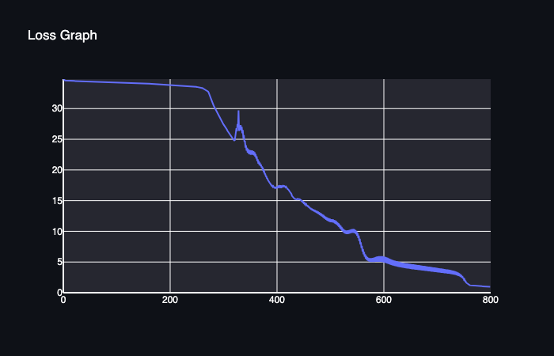

# MiniTorch Module 2


## Task 2.5 Training

### Simple

Training Results

Training Time Per Peoch: 0.069s


Training Log

```bash
Epoch: 0/500, loss: 0, correct: 0
Epoch: 10/500, loss: 35.63422196170521, correct: 27
Epoch: 20/500, loss: 34.81286805060806, correct: 27
Epoch: 30/500, loss: 34.523083998248026, correct: 27
Epoch: 40/500, loss: 34.336536462220096, correct: 27
Epoch: 50/500, loss: 34.180587859111434, correct: 27
Epoch: 60/500, loss: 34.035305627178516, correct: 27
Epoch: 70/500, loss: 33.89224628530648, correct: 27
Epoch: 80/500, loss: 33.746385922662505, correct: 27
Epoch: 90/500, loss: 33.594000633353374, correct: 27
Epoch: 100/500, loss: 33.4319056627737, correct: 27
Epoch: 110/500, loss: 33.25708127273409, correct: 27
Epoch: 120/500, loss: 33.06643066556114, correct: 27
Epoch: 130/500, loss: 32.856582919928975, correct: 27
Epoch: 140/500, loss: 32.62369987884965, correct: 27
Epoch: 150/500, loss: 32.36325974739965, correct: 27
Epoch: 160/500, loss: 32.06979268623294, correct: 27
Epoch: 170/500, loss: 31.73654064131479, correct: 27
Epoch: 180/500, loss: 31.355007258499235, correct: 27
Epoch: 190/500, loss: 30.914356271535645, correct: 27
Epoch: 200/500, loss: 30.400613738991947, correct: 27
Epoch: 210/500, loss: 29.795645969292757, correct: 29
Epoch: 220/500, loss: 29.075959005828224, correct: 32
Epoch: 230/500, loss: 28.211583958468815, correct: 35
Epoch: 240/500, loss: 27.174084025215713, correct: 37
Epoch: 250/500, loss: 25.923104219646554, correct: 39
Epoch: 260/500, loss: 24.428635191257424, correct: 41
Epoch: 270/500, loss: 22.691609477877357, correct: 43
Epoch: 280/500, loss: 20.724616072140556, correct: 47
Epoch: 290/500, loss: 18.727681141211473, correct: 47
Epoch: 300/500, loss: 16.95034933978301, correct: 47
Epoch: 310/500, loss: 15.481982016601666, correct: 48
Epoch: 320/500, loss: 14.128247110192962, correct: 49
Epoch: 330/500, loss: 12.896418538127593, correct: 49
Epoch: 340/500, loss: 11.763120240907105, correct: 49
Epoch: 350/500, loss: 10.795355352827787, correct: 49
Epoch: 360/500, loss: 10.022830238010881, correct: 49
Epoch: 370/500, loss: 9.323542225269069, correct: 49
Epoch: 380/500, loss: 8.693814460185699, correct: 49
Epoch: 390/500, loss: 8.169461257135115, correct: 49
Epoch: 400/500, loss: 7.705844528597107, correct: 49
Epoch: 410/500, loss: 7.28246369319193, correct: 49
Epoch: 420/500, loss: 6.895923519423604, correct: 49
Epoch: 430/500, loss: 6.545594163479261, correct: 49
Epoch: 440/500, loss: 6.243783728565889, correct: 49
Epoch: 450/500, loss: 5.9769296828917415, correct: 49
Epoch: 460/500, loss: 5.729894843270769, correct: 49
Epoch: 470/500, loss: 5.500599469861524, correct: 50
Epoch: 480/500, loss: 5.28746755528187, correct: 50
Epoch: 490/500, loss: 5.089750467702381, correct: 50
Epoch: 500/500, loss: 4.9112429937037, correct: 50
```

Parameters

|           | Size of hidden layer | Learning rate | Number of epochs |
| --------- | -------------------- | ------------- | ---------------- |
| parameter | 3                    | 0.1           | 500             |


### Diag

Training Results

Training Time Per Peoch: 0.070s


Training Log

```bash
Epoch: 0/500, loss: 0, correct: 0
Epoch: 10/500, loss: 39.80715236748795, correct: 7
Epoch: 20/500, loss: 28.20985909035068, correct: 44
Epoch: 30/500, loss: 22.072700519979534, correct: 43
Epoch: 40/500, loss: 19.157898484143104, correct: 43
Epoch: 50/500, loss: 17.62197153167046, correct: 43
Epoch: 60/500, loss: 16.534275731045536, correct: 43
Epoch: 70/500, loss: 15.604505161051613, correct: 43
Epoch: 80/500, loss: 14.683037696840671, correct: 43
Epoch: 90/500, loss: 13.723171151373768, correct: 43
Epoch: 100/500, loss: 12.69979822147935, correct: 43
Epoch: 110/500, loss: 11.666587502025358, correct: 43
Epoch: 120/500, loss: 10.641561599708886, correct: 44
Epoch: 130/500, loss: 9.646497646362386, correct: 46
Epoch: 140/500, loss: 8.709697289244476, correct: 46
Epoch: 150/500, loss: 7.855612633357014, correct: 48
Epoch: 160/500, loss: 7.093376167857309, correct: 49
Epoch: 170/500, loss: 6.434167072165878, correct: 50
Epoch: 180/500, loss: 5.8582515070309675, correct: 50
Epoch: 190/500, loss: 5.357736214705468, correct: 50
Epoch: 200/500, loss: 4.917213534057926, correct: 50
Epoch: 210/500, loss: 4.53413364845061, correct: 50
Epoch: 220/500, loss: 4.19371446825108, correct: 50
Epoch: 230/500, loss: 3.8942895172646947, correct: 50
Epoch: 240/500, loss: 3.6320094497928994, correct: 50
Epoch: 250/500, loss: 3.3990791853529374, correct: 50
Epoch: 260/500, loss: 3.1946524296577503, correct: 50
Epoch: 270/500, loss: 3.0119939791270838, correct: 50
Epoch: 280/500, loss: 2.845691961328556, correct: 50
Epoch: 290/500, loss: 2.695490841478928, correct: 50
Epoch: 300/500, loss: 2.559611541899306, correct: 50
Epoch: 310/500, loss: 2.4347115949847473, correct: 50
Epoch: 320/500, loss: 2.320354161938644, correct: 50
Epoch: 330/500, loss: 2.215422954651186, correct: 50
Epoch: 340/500, loss: 2.1173559599940184, correct: 50
Epoch: 350/500, loss: 2.028036293886772, correct: 50
Epoch: 360/500, loss: 1.9444852382340763, correct: 50
Epoch: 370/500, loss: 1.8679712756356381, correct: 50
Epoch: 380/500, loss: 1.798347044690455, correct: 50
Epoch: 390/500, loss: 1.7328239037473745, correct: 50
Epoch: 400/500, loss: 1.6711091373607292, correct: 50
Epoch: 410/500, loss: 1.6138867203957032, correct: 50
Epoch: 420/500, loss: 1.561219170264106, correct: 50
Epoch: 430/500, loss: 1.5105537074495123, correct: 50
Epoch: 440/500, loss: 1.462389572074072, correct: 50
Epoch: 450/500, loss: 1.4178569368348533, correct: 50
Epoch: 460/500, loss: 1.3757167623801372, correct: 50
Epoch: 470/500, loss: 1.3349106867837381, correct: 50
Epoch: 480/500, loss: 1.2961857871921851, correct: 50
Epoch: 490/500, loss: 1.2595278960297338, correct: 50
Epoch: 500/500, loss: 1.2247198211459605, correct: 50
```

Parameters

|           | Size of hidden layer | Learning rate | Number of epochs |
| --------- | -------------------- | ------------- | ---------------- |
| parameter | 3                    | 0.1           | 500             |


### Split

Training Results

Training Time Per Peoch: 0.070s




Training Log

```bash
Epoch: 0/800, loss: 0, correct: 0
Epoch: 10/800, loss: 34.547667178248616, correct: 27
Epoch: 20/800, loss: 34.50586011071275, correct: 27
Epoch: 30/800, loss: 34.46469103355566, correct: 27
Epoch: 40/800, loss: 34.418344438797455, correct: 32
Epoch: 50/800, loss: 34.39050081221773, correct: 30
Epoch: 60/800, loss: 34.36902301332555, correct: 29
Epoch: 70/800, loss: 34.34569173936382, correct: 29
Epoch: 80/800, loss: 34.320754374714184, correct: 27
Epoch: 90/800, loss: 34.297263114986336, correct: 27
Epoch: 100/800, loss: 34.27422169421581, correct: 26
Epoch: 110/800, loss: 34.236785785703034, correct: 26
Epoch: 120/800, loss: 34.17392796754882, correct: 26
Epoch: 130/800, loss: 34.140304034784705, correct: 27
Epoch: 140/800, loss: 34.11233634997369, correct: 27
Epoch: 150/800, loss: 34.08283806707554, correct: 27
Epoch: 160/800, loss: 34.051211465110036, correct: 27
Epoch: 170/800, loss: 34.018678153002575, correct: 27
Epoch: 180/800, loss: 33.9827610572616, correct: 26
Epoch: 190/800, loss: 33.93763284482974, correct: 25
Epoch: 200/800, loss: 33.890397525186025, correct: 25
Epoch: 210/800, loss: 33.83720320176845, correct: 27
Epoch: 220/800, loss: 33.77682543929117, correct: 27
Epoch: 230/800, loss: 33.70799059041551, correct: 27
Epoch: 240/800, loss: 33.62865876225523, correct: 27
Epoch: 250/800, loss: 33.538461316160564, correct: 27
Epoch: 260/800, loss: 33.43338031699525, correct: 28
Epoch: 270/800, loss: 32.94835461248259, correct: 30
Epoch: 280/800, loss: 30.955209133896773, correct: 39
Epoch: 290/800, loss: 29.188146382534665, correct: 42
Epoch: 300/800, loss: 27.545421029702588, correct: 42
Epoch: 310/800, loss: 26.14354101786832, correct: 41
Epoch: 320/800, loss: 24.892340775646275, correct: 41
Epoch: 330/800, loss: 26.353667185554063, correct: 34
Epoch: 340/800, loss: 24.59259939760781, correct: 39
Epoch: 350/800, loss: 22.537113820978323, correct: 41
Epoch: 360/800, loss: 22.190195893089097, correct: 40
Epoch: 370/800, loss: 20.644022615989506, correct: 41
Epoch: 380/800, loss: 18.98514841338457, correct: 42
Epoch: 390/800, loss: 17.622233574301525, correct: 43
Epoch: 400/800, loss: 17.279428076209243, correct: 44
Epoch: 410/800, loss: 17.456550100427137, correct: 43
Epoch: 420/800, loss: 17.068499392441694, correct: 40
Epoch: 430/800, loss: 15.677421202720087, correct: 40
Epoch: 440/800, loss: 15.268217752002403, correct: 40
Epoch: 450/800, loss: 14.802173066860995, correct: 40
Epoch: 460/800, loss: 14.144346823213393, correct: 40
Epoch: 470/800, loss: 13.546017609511518, correct: 41
Epoch: 480/800, loss: 13.107497325108614, correct: 42
Epoch: 490/800, loss: 12.529150990853756, correct: 42
Epoch: 500/800, loss: 12.07868746405234, correct: 42
Epoch: 510/800, loss: 11.762440699105213, correct: 42
Epoch: 520/800, loss: 10.92671308000068, correct: 43
Epoch: 530/800, loss: 10.125424156171338, correct: 44
Epoch: 540/800, loss: 10.31315653846049, correct: 44
Epoch: 550/800, loss: 9.995789464017363, correct: 45
Epoch: 560/800, loss: 7.631293729798972, correct: 47
Epoch: 570/800, loss: 5.813014403577943, correct: 47
Epoch: 580/800, loss: 5.653132391033629, correct: 47
Epoch: 590/800, loss: 5.916668590268143, correct: 47
Epoch: 600/800, loss: 5.911013517266359, correct: 47
Epoch: 610/800, loss: 5.601789778194383, correct: 47
Epoch: 620/800, loss: 5.252422250324198, correct: 47
Epoch: 630/800, loss: 5.006798216541971, correct: 47
Epoch: 640/800, loss: 4.826899909819575, correct: 47
Epoch: 650/800, loss: 4.6958416875150615, correct: 47
Epoch: 660/800, loss: 4.560295984402802, correct: 47
Epoch: 670/800, loss: 4.433733869875646, correct: 47
Epoch: 680/800, loss: 4.306327248299107, correct: 47
Epoch: 690/800, loss: 4.176073869393069, correct: 47
Epoch: 700/800, loss: 4.044846796038513, correct: 47
Epoch: 710/800, loss: 3.9087423878202476, correct: 47
Epoch: 720/800, loss: 3.772036461877124, correct: 48
Epoch: 730/800, loss: 3.592455183144288, correct: 48
Epoch: 740/800, loss: 3.265084974321174, correct: 48
Epoch: 750/800, loss: 2.462535540634567, correct: 49
Epoch: 760/800, loss: 1.2794290502599421, correct: 50
Epoch: 770/800, loss: 1.1468826965186294, correct: 50
Epoch: 780/800, loss: 1.0821978910808543, correct: 50
Epoch: 790/800, loss: 1.0233400425418664, correct: 50
Epoch: 800/800, loss: 0.9693677160649345, correct: 50
```

Parameters

|           | Size of hidden layer | Learning rate | Number of epochs |
| --------- | -------------------- | ------------- | ---------------- |
| parameter | 3                    | 0.5           | 800             |


### Xor

Training Results

Training Time Per Peoch: 0.290s


Training Log

```bash
Epoch: 0/800, loss: 0, correct: 0
Epoch: 10/800, loss: 29.203777298087818, correct: 37
Epoch: 20/800, loss: 27.08874861119393, correct: 37
Epoch: 30/800, loss: 25.408303343023352, correct: 38
Epoch: 40/800, loss: 23.589563338101627, correct: 38
Epoch: 50/800, loss: 21.808504046808046, correct: 39
Epoch: 60/800, loss: 20.44252378040571, correct: 40
Epoch: 70/800, loss: 21.536503534133082, correct: 40
Epoch: 80/800, loss: 19.46093421579981, correct: 43
Epoch: 90/800, loss: 19.055656121656327, correct: 41
Epoch: 100/800, loss: 16.885512212693246, correct: 43
Epoch: 110/800, loss: 14.834642028616955, correct: 44
Epoch: 120/800, loss: 13.711927609101572, correct: 44
Epoch: 130/800, loss: 13.054266129743095, correct: 45
Epoch: 140/800, loss: 11.312283061160066, correct: 45
Epoch: 150/800, loss: 11.989310069222228, correct: 44
Epoch: 160/800, loss: 10.879600044517872, correct: 45
Epoch: 170/800, loss: 9.452654477214708, correct: 47
Epoch: 180/800, loss: 8.811162880805995, correct: 47
Epoch: 190/800, loss: 9.518389730530236, correct: 46
Epoch: 200/800, loss: 8.805897932982829, correct: 47
Epoch: 210/800, loss: 6.411717921288823, correct: 48
Epoch: 220/800, loss: 8.304109189277941, correct: 45
Epoch: 230/800, loss: 10.061971497674035, correct: 45
Epoch: 240/800, loss: 6.781650706913001, correct: 47
Epoch: 250/800, loss: 5.253673483290304, correct: 49
Epoch: 260/800, loss: 4.84637775763991, correct: 49
Epoch: 270/800, loss: 4.7777488618918555, correct: 48
Epoch: 280/800, loss: 4.778289148051763, correct: 48
Epoch: 290/800, loss: 4.258352897839283, correct: 49
Epoch: 300/800, loss: 3.2272927117058203, correct: 50
Epoch: 310/800, loss: 4.435593639607229, correct: 49
Epoch: 320/800, loss: 10.425240160722806, correct: 46
Epoch: 330/800, loss: 2.4663564572889585, correct: 50
Epoch: 340/800, loss: 2.1432268527315195, correct: 50
Epoch: 350/800, loss: 1.9845850968412473, correct: 50
Epoch: 360/800, loss: 1.8545041315770554, correct: 50
Epoch: 370/800, loss: 1.7359641744969296, correct: 50
Epoch: 380/800, loss: 1.6256022417822895, correct: 50
Epoch: 390/800, loss: 1.5336885776016371, correct: 50
Epoch: 400/800, loss: 1.4516134078667158, correct: 50
Epoch: 410/800, loss: 1.3757931908495975, correct: 50
Epoch: 420/800, loss: 1.304870744058073, correct: 50
Epoch: 430/800, loss: 1.2407262043408773, correct: 50
Epoch: 440/800, loss: 1.1810972831368698, correct: 50
Epoch: 450/800, loss: 1.1262991658764085, correct: 50
Epoch: 460/800, loss: 1.0758669911492764, correct: 50
Epoch: 470/800, loss: 1.0285810571197211, correct: 50
Epoch: 480/800, loss: 0.9845136122165447, correct: 50
Epoch: 490/800, loss: 0.9433237451761656, correct: 50
Epoch: 500/800, loss: 0.9046618379802739, correct: 50
Epoch: 510/800, loss: 0.8686859053017303, correct: 50
Epoch: 520/800, loss: 0.8349676287873112, correct: 50
Epoch: 530/800, loss: 0.8033581955077821, correct: 50
Epoch: 540/800, loss: 0.7731445548981557, correct: 50
Epoch: 550/800, loss: 0.7451245959309643, correct: 50
Epoch: 560/800, loss: 0.7185595738045489, correct: 50
Epoch: 570/800, loss: 0.6935027208793453, correct: 50
Epoch: 580/800, loss: 0.6697601622236503, correct: 50
Epoch: 590/800, loss: 0.6481352931873116, correct: 50
Epoch: 600/800, loss: 0.6265285836102743, correct: 50
Epoch: 610/800, loss: 0.6060962234595109, correct: 50
Epoch: 620/800, loss: 0.58721371486947, correct: 50
Epoch: 630/800, loss: 0.569082451978705, correct: 50
Epoch: 640/800, loss: 0.5518153673821331, correct: 50
Epoch: 650/800, loss: 0.5356074695937442, correct: 50
Epoch: 660/800, loss: 0.5200492662958888, correct: 50
Epoch: 670/800, loss: 0.5051494464929759, correct: 50
Epoch: 680/800, loss: 0.4909869933596134, correct: 50
Epoch: 690/800, loss: 0.47740707866023513, correct: 50
Epoch: 700/800, loss: 0.4645354632505865, correct: 50
Epoch: 710/800, loss: 0.4519746836894142, correct: 50
Epoch: 720/800, loss: 0.4401023337212014, correct: 50
Epoch: 730/800, loss: 0.42874836976981195, correct: 50
Epoch: 740/800, loss: 0.41779881704270133, correct: 50
Epoch: 750/800, loss: 0.40750929171743455, correct: 50
Epoch: 760/800, loss: 0.39733247272265965, correct: 50
Epoch: 770/800, loss: 0.38769317318037083, correct: 50
Epoch: 780/800, loss: 0.378531726454092, correct: 50
Epoch: 790/800, loss: 0.36963721706043157, correct: 50
Epoch: 800/800, loss: 0.36110932747691266, correct: 50
```

Parameters

|           | Size of hidden layer | Learning rate | Number of epochs |
| --------- | -------------------- | ------------- | ---------------- |
| parameter | 9                    | 0.5           | 800             |

